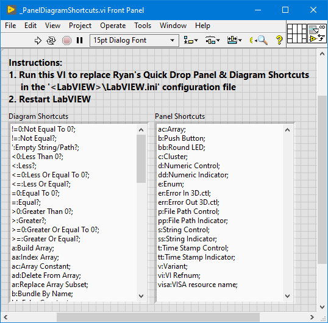
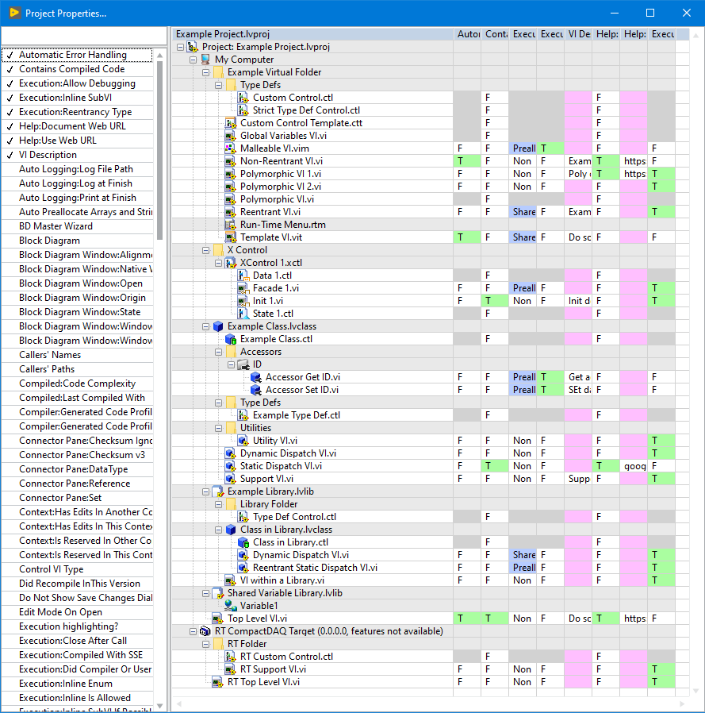

# labview_quickdrop
Ryan's Quick Drop and IDE Plugins for LabVIEW

After years of LabVIEW development, I got tired of doing the same thing over
and over again. With the introduction of LabVIEW's Quick Drop Shortcuts, I
started adding my own custom macros and IDE plugins to help expedite
LabVIEW development and simplify style guide standardization.

Here are a small collection of plugins I use daily...

## Installation
To install, download and run the VI Package (\*.vip) using JKI's
[VI Package Manager (VIPM)](https://vipm.jki.net)
 *Note: VIPM is automatically installed with LabVIEW 2019+.*

| VI Package | LabVIEW | VIPM |
| --- | --- | --- |
| [ryans_quick_drop_shortcuts-0.3.0.23.vip](https://github.com/rcpacini/labview_quickdrop/raw/master/releases/ryans_quick_drop_shortcuts-0.3.0.23.vip) | LV2019+ | 2019+ |

See [releases](releases) to download other versions.

---

## Getting Started
Refer to the documentation below to see examples on how to use
each of the Quick Drop Shortcuts and IDE Plugins.

*Once installed, an example VI is also located at: 
`<LabVIEW>\examples\rcpacini\Ryans Quick Drop Shortcuts\Ryans Quick Drop Example.vit`*

---

### Quick Drop - Plugins
Refer to the Quick Drop Plugin help for more information:

| Shortcut | Quick Drop Plugins |
| --- | --- |
| `Ctrl-A` | [Arrange Panel or Diagram](docs/Arrange.md) |
| `Ctrl-E` | [Resize Window](docs/ResizeWindow.md) |
| `Ctrl-S` | [Execute Script](docs/ExecuteScript.md) |

---

### Quick Drop - Panel and Diagram Shortcuts

**(Optional)** Run the [Panel and Diagram Shortcuts](https://github.com/rcpacini/labview_quickdrop/raw/master/QuickDrop/plugins/_Script/_PanelDiagramShortcuts.vi)
VI to replace the Quick Drop Panel & Diagram Shortcuts in the
`<LabVIEW>\LabVIEW.ini` file. 
***Note: LabVIEW must be restarted to reload the Quick Drop
Shortcuts.***

[Download VI Snippet (LV2019)](https://github.com/rcpacini/labview_quickdrop/raw/master/docs/imgs/PanelDiagramShortcuts.png)

---

### Tools Menu - Plugins
Refer to the Project Properties help for more information.

| Tools Menu Plugins | Documentation |
| --- | --- |
| `Tools > Ryans Project Properties...` | [Project Properties Explorer](docs/ProjectProperties.md) |

---

## Build Specifications
### Source Code
To edit the source code, open the
`QuickDrop\RyansQuickDropShortcuts.lvproj`
project in LabVIEW 2019+, keep the `VI_Tree.vi` open to ensure all VI
dependencies are loaded while editing. Save the project.

### VI Package
To rebuild the VI Package, open the
`QuickDrop\RyansQuickDropShortcuts.vipb`
VI Package Build in VI Package Manager 2019+, edit the package details.
Press Build to output the VI Package (\*.vip) into the `releases`
directory.

This package installs the Quick Drop Shortcuts to  
`<LabVIEW>\resource\dialog\QuickDrop\plugins`:
 * `Ryans Arrange.vi` - Arrange Panel or Diagram (**Ctrl-A**)
 * `Ryans Resize Window.vi` - Resize Window (**Ctrl-E**)
 * `Ryans Script.vi` - Execute Script (**Ctrl-S**)
 * `_Script\` - Support VIs

and IDE Plugins to `<LabVIEW>\project`:
 * `Ryans Project Properties.vi` - VI Properties Explorer (**Tools > Ryans
Project Properties...**)
 * `_Project Properties\` - Support VIs

---

## Contribute
Submit a ticket for bug fixes or feature requests. Feedback is welcome!

-Ryan
