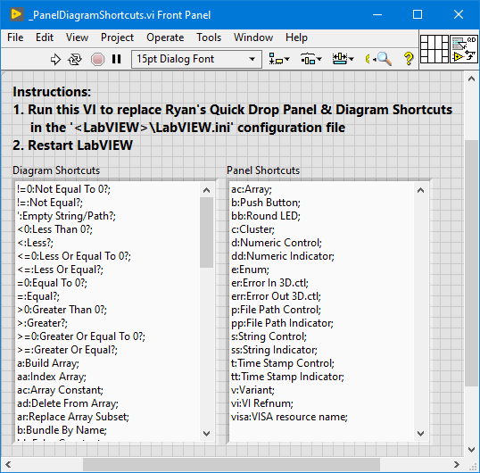

# labview_quickdrop
Ryan's Quick Drop and IDE Plugins for LabVIEW

After years of LabVIEW development, I got tired of doing the same thing over
and over again. With the introduction of LabVIEW's Quick Drop Shortcuts, I
started adding my own custom macros and IDE plugins to help expedite
development and simplify style guide standardization.

Here are a small collection of plugins I use daily to help expedite LabVIEW
development.

## Installation
To install, download and run the VI Package (\*.vip) using JKI's VI Package Management (VIPM) which is installed with LabVIEW.

| VI Package | LabVIEW | VIPM |
| --- | --- | --- |
| [ryans_quick_drop_shortcuts-0.3.0.23.vip](https://github.com/rcpacini/labview_quickdrop/raw/master/releases/ryans_quick_drop_shortcuts-0.3.0.23.vip) | LV2019+ | 2019+ |

See [releases](releases) to download other versions.

## Getting Started
The package installs the Quick Drop Shortcuts and Tools Menu Plugins to
`<LabVIEW>\resource\dialog\QuickDrop\plugins` and `<LabVIEW>\project`
directories respectively.

### Quick Drop - Plugins

| Shortcut | Quick Drop Plugins |
| --- | --- |
| `Ctrl-A` | [Arrange Panel or Diagram](docs/Arrange.md) |
| `Ctrl-E` | [Resize Window](docs/ResizeWindow.md) |
| `Ctrl-S` | [Execute Script](docs/ExecuteScript.md) |

### Quick Drop - Panel and Diagram Shortcuts

**(Optional)** Run the [Panel and Diagram Shortcuts](https://github.com/rcpacini/labview_quickdrop/raw/master/QuickDrop/plugins/_Script/_PanelDiagramShortcuts.vi)
VI to replace the Quick Drop Panel & Diagram Shortcuts.
***Note: LabVIEW must be restarted to reload the Quick Drop Shortcuts.***

[Download](https://github.com/rcpacini/labview_quickdrop/raw/master/docs/PanelDiagramShortcuts.png)

### Tools Menu - Plugins

| Tools Menu Plugins | Description |
| --- | --- |
| [`Tools > Project Properties...`](docs/ProjectProperties.md) | View VI Properties for the entire Project side-by-side. |

## Build
To edit the source code, open the `QuickDrop\RyansQuickDropShortcuts.lvproj`
project in LabVIEW 2019+, keep the `VI_Tree.vi` open to ensure all VI
dependencies are loaded while editing. Save the project.

To rebuild the VI Package, open the `QuickDrop\RyansQuickDropShortcuts.vipb`
VI Package Build in VI Package Manager 2019+, edit the package details.
Press Build to output the VI Package (\*.vip) into the `releases` directory.

## Contribution
Submit a ticket for bug fixes or feature requests. Feedback is welcome!

-Ryan
