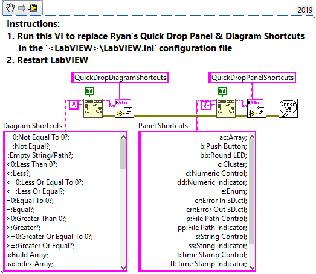

# labview_quickdrop
Ryan's Quick Drop Shortcuts for LabVIEW "that you'll actually use..."

## Releases
To install, download and run the VI Package (\*.vip) using JKI's VI Package Management (VIPM) which is installed with LabVIEW.<br>
See [releases](releases) to download other versions.

| VI Package | Version | LabVIEW |
| --- | --- | --- |
| [ryans_quick_drop_shortcuts-0.1.3.16.vip](releases/ryans_quick_drop_shortcuts-0.1.3.16.vip?raw=True) | v0.1.3.16 | 2019 |

Refer to the [Release Notes](docs/ReleaseNotes.md) for version information.<br>

## Quick Drop - Panel & Diagram Shortcuts
Download and run the following VI Snippet to replace the Quick Drop Panel & Diagram Shortcuts in the LabVIEW.ini configuration file.



[Download](docs/PanelDiagramShortcuts.png?raw=True)

## Quick Drop Shortcuts - Plugins
There are a total of 4 Quick Drop Plugins I use daily:

| Key | Plugin |
| --- | --- |
| `Ctrl-A` | [Arrange Diagram](#ctrl-a-arrange-diagram) |
| `Ctrl-E` | [Resize Diagram](#ctrl-e-resize-diagram) |
| `Ctrl-G` | [Get Object Info](#ctrl-g-get-object-info) |
| `Ctrl-S` | [Execute Script](#ctrl-s-execute-script) |

I quickly realized there aren't enough keys on the keyboard for each Quick Drop shortcut I needed. So instead, I created the **Execute Script** plugin which uses the Quick Drop Textbox to define a series of commands to execute on the selected panel or diagram objects. The plugin includes built-in help and a shortcut configuration editor (similar to the Quick-Drop Plugins dialog). <br>
Refer to the [Execute Script](docs/ExecuteScript.md) for support to add your own extensions.

### Ctrl-A | Arrange Diagram
Arranges diagram (`Ctrl-A`) cleans up the selected block diagram objects using their adjacent position of the source or destination terminals (left-to-right or right-to-left). If nothing is selected, this horizontally aligns the top level diagram control and indicator terminals. `Ctrl-Shift-A` reverses the order to arrange the diagram (right-to-left). Use these in combination to clean up the block diagram quickly.

Object alignment depends on the **number of connected terminals** and the **arrange order (Left-to-Right or Right-to-Left)**. If more that one terminal is connected, the following defines which terminal used to align:

| # Ins | # Outs | `Ctrl=-A` (L2R) | `Ctrl-Shift-A` (R2L) |
| --- | --- | --- | --- |
| 1+ | 0 | Bottom-Left Input | Top-Left Input |
| 0 | 1+ | Bottom-Right Output | Top-Right Output |
| 1+ | 1+ | Bottom-Left Input | Bottom-Right Output |


### Ctrl-E | Resize Diagram
Resizes the block diagram window to fit the content. (Front Panel focus does nothing).


### Ctrl-G | Get Object Info
Displays basic information about the panel or diagram object selected such as VI Server Class ID, Class Name, Class Hierarchy, Master Bound Rectangle, etc. This is useful during development of VI Scripting.


### [Ctrl-S | Execute Script](docs/ExecuteScript.md)
Executes a series of VI scripts (i.e. macros) using the Quick Drop textbox arguments (separated by space) on the selected panel or diagram objects. By default, there are a bunch of [Built-in Scripts](docs/ExecuteScript.md) for common operations, such as: align + distribute objects, connect terminals to pane, change representation and hide/show display objects. <br>
Refer to the [Execute Script](docs/ExecuteScript.md) page for more information.

Getting Started: `Ctrl-Space + "help" + Ctrl-S`


*Script Example:*<br> Select a Numeric Control, open Quick Drop (`Ctrl-Space`), type `u8 h rx -- Data in`, then press `Ctrl-S` to change the selected numeric control to **U8 representation**, hide the **+/- buttons** and display the **radix in hex** and rename the label to **"Data in"**.


#### Ctrl-S | Execute Script - Custom Plugins
Create your own script plugins using the VI Template:<br>
`<labview>\resource\dialog\QuickDrop\plugins\_Script\Script_Template.vit`.<br>
Save the VI to the `_Script` directory and edit the VI Description to update the `[SCRIPT]` section with `shortcut=Short Name` (key=value) pairs for the supported shortcuts. <br>
Refer to the [Execute Script](docs/ExecuteScript.md) page for more information.
```ini
// Add VI description

[SCRIPT]
abc=My Shortcut
--xyz=My Shortcut with Args
```

## Support
Submit a ticket for bug fixes or feature requests. Feedback is welcome!

-Ryan
