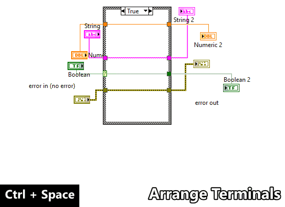
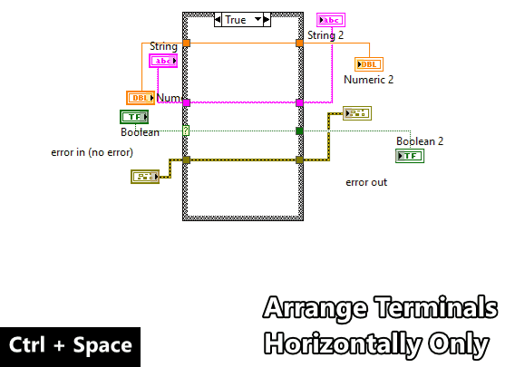
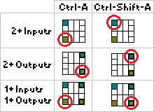

# `Ctrl-A` = Arrange Panel or Diagram
Arrange Panel or Diagram (`Ctrl-A`) cleans up the selected block diagram
or front panel objects using their position relative to the adjacent object.

There are a few variations depending on the Front Panel (`FP`) or Block Diagram
(`BD`) focus, if objects are selected (`1+`), and alternate action
(`Shift`).

| Variation | Description |
| --- | --- |
| `FP` | [Arrange to Grid](#fp--arrange-to-grid) |
| `FP` + `Shift` | [Arrange to Connector Pane](#fp--shift--arrange-to-connector-pane) |
| `FP` + `1+` | [Arrange to Left Edge](#fp--1--arrange-to-left-edge) |
| `FP` + `1+` + `Shift` | [Arrange to Top Edge](#fp--1--shift--arrange-to-top-edge) |
| `BD` | [Arrange Terminals](#bd--arrange-terminals) |
| `BD` + `Shift` | [Arrange Terminals Horizontally Only](#bd--shift--arrange-terminals-horizontally-only) |
| `BD` + `1+` | [Arrange to Adjacent Terminal](#bd--1--arrange-to-adjacent-terminal) |
| `BD` + `1+` + `Shift` | [Arrange to Adjacent Terminal Reversed](#bd--1--shift--arrange-to-adjacent-terminal-reversed) |

---

## `FP` = Arrange to Grid
Arrange all controls and indicators to grid map. Error clusters are
prioritized to map to the bottom left and bottom right positions. The controls and indicators are offset from the panel origin. The panel origin is reset to (0, 0).

> **Support:** `FP` | **GObject:** `N/A` | **Selection:** `N/A`

**Usage:** `FP` + `Ctrl-A`

---

## `FP` + `Shift` = Arrange to Connector Pane
Arrange all controls and indicators to connector pane positions.

> **Support:** `FP` | **GObject:** `N/A` | **Selection:** `N/A`

**Usage:** `FP` + `Ctrl-Shift-A`

---

## `FP` + `1+` = Arrange to Left Edge
Arrange selected objects to the left edge excluding display objects 
(labels, captions, inc/dec buttons, index displays, etc.) and snap to nearest 
panel grid position.

> **Support:** `FP` | **GObject:** `Any` | **Selection:** `1+`

**Usage:** `FP` + `Select Controls` + `Ctrl-A`

---

## `FP` + `1+` + `Shift` = Arrange to Top Edge
Arrange selected objects to the top edge excluding display objects 
(labels, captions, inc/dec buttons, index displays, etc.) and snap to nearest 
panel grid position.

> **Support:** `FP` | **GObject:** `Any` | **Selection:** `1+`

**Usage:** `FP` + `Select Controls` + `Ctrl-Shift-A`

---

## `BD` = Arrange Terminals
Arrange controls and indicators to left and right sides and align terminals
vertically to adjacent terminal position.

> **Support:** `BD` | **GObject:** `N/A` | **Selection:** `N/A`

**Usage:** `BD` + `Ctrl-A`

---

## `BD` + `Shift` = Arrange Terminals Horizontally Only
Arrange controls and indicators to left and right sides only.

> **Support:** `BD` | **GObject:** `N/A` | **Selection:** `N/A`

**Usage:** `BD` + `Ctrl-Shift-A`

---

## `BD` + `1+` = Arrange to Adjacent Terminal
Arrange selected object's terminal to the adjacent terminal position sorted
left-to-right.
Constants are arranged adjacent source terminal position (Centered left, top
or bottom to the destination terminal).

> **Support:** `BD` | **GObject:** `Any` | **Selection:** `1+`

**Usage:** `BD` + `Select GObjects` + `Ctrl-A`

---

## `BD` + `1+` + `Shift` = Arrange to Adjacent Terminal Reversed
Arrange selected objects vertically to the adjacent terminal position sorted
right-to-left.

> **Support:** `BD` | **GObject:** `Any` | **Selection:** `1+`

**Usage:** `BD` + `Select GObjects` + `Ctrl-Shift-A`

---

# Terminal Prioritization
Terminal alignment depends on the **number of connected terminals
(Sinks vs. Sources)** and the **arrange order
(Left-to-Right vs. Right-to-Left)** wired to the object.
If more that one adjacent terminal exists, the following picture defines
which terminal the object will align to:

