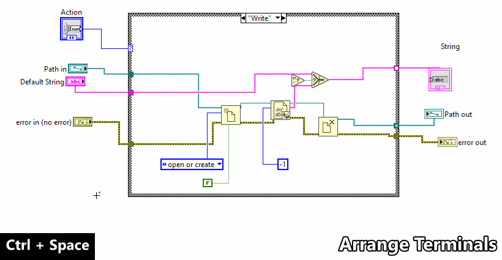
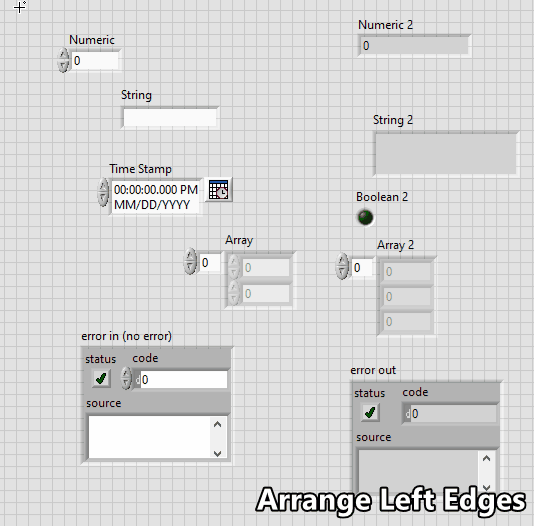
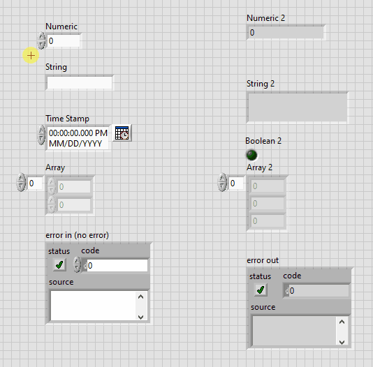
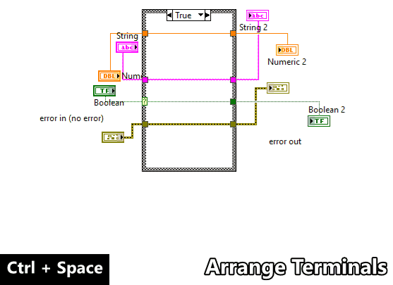
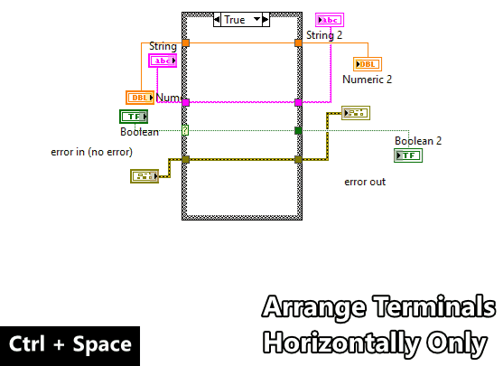
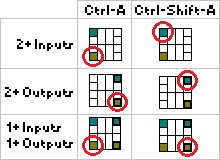

# `Ctrl-A` = Arrange Panel or Diagram
Arrange Panel or Diagram (`Ctrl-A`) cleans up the selected block diagram
or front panel objects using their position relative to the adjacent object.

---

## Methods
There are a few variations depending on the Front Panel (`FP`) or Block Diagram
(`BD`) focus, if objects are selected (`1+`), and alternate action
(`Shift`).

| Variation | Description |
| --- | --- |
| `FP` | [Arrange to Grid](#fp--arrange-to-grid) |
| `FP` + `Shift` | [Arrange to Connector Pane](#fp--shift--arrange-to-connector-pane) |
| `FP` + `1+` | [Arrange to Left Edge](#fp--1--arrange-to-left-edge) |
| `FP` + `1+` + `Shift` | [Arrange to Top Edge](#fp--1--shift--arrange-to-top-edge) |
| `BD` | [Arrange Terminals](#bd--arrange-terminals) |
| `BD` + `Shift` | [Arrange Terminals Horizontally Only](#bd--shift--arrange-terminals-horizontally-only) |
| `BD` + `1+` | [Arrange to Adjacent Terminal](#bd--1--arrange-to-adjacent-terminal) |
| `BD` + `1+` + `Shift` | [Arrange to Adjacent Terminal Reversed](#bd--1--shift--arrange-to-adjacent-terminal-reversed) |

---

## `FP` = Arrange to Grid
Arrange all controls and indicators by grid map and snaps the objects
to the nearest panel grid position (default:12px). Error clusters are
prioritized to map to the bottom left and bottom right positions. The
controls and indicators are offset from the panel origin
by (Left:48px, Top:36px).
The panel origins are reset to (0, 0). Hidden controls and indicators
are ignored.

> **Support:** `FP` | **GObject:** `N/A` | **Selection:** `N/A`

**Usage:** `FP` + `Ctrl-A`

**Example:** `FP` + `Ctrl-Space` + `Ctrl-A`

---

## `FP` + `Shift` = Arrange to Connector Pane
Arrange all controls and indicators to their connector pane positions and
snap the objects to the nearest panel grid position (default:12px).
Wired terminals take priority. The controls and indicators are offset from
the panel orign by (Left:48px, Top:36px).
The panel origins are reset to (0, 0). Hidden controls and indicators are
ignored.

> **Support:** `FP` | **GObject:** `N/A` | **Selection:** `N/A`

**Usage:** `FP` + `Ctrl-Shift-A`

**Example:** `FP` + `Ctrl-Space` + `Ctrl-Shift-A`

---

## `FP` + `1+` = Arrange to Left Edge
Arrange the selected objects by their left edges excluding display objects
(labels, captions, inc/dec buttons, index displays, etc.) and snap the
objects to the nearest panel grid position (default:12px).

> **Support:** `FP` | **GObject:** `Any` | **Selection:** `1+`

**Usage:** `FP` + `Select Controls` + `Ctrl-A`

**Example:** `FP` + `Select Controls` + `Ctrl-Space` + `Ctrl-A`

---

## `FP` + `1+` + `Shift` = Arrange to Top Edge
Arrange the selected objects by their top edges excluding display objects
(labels, captions, inc/dec buttons, index displays, etc.) and snap the
objects to the nearest panel grid position (default:12px).

> **Support:** `FP` | **GObject:** `Any` | **Selection:** `1+`

**Usage:** `FP` + `Select Controls` + `Ctrl-Shift-A`

**Example:** `FP` + `Select Controls` + `Ctrl-Space` + `Ctrl-Shift-A`

---

## `BD` = Arrange Terminals
Arrange all control and indicator terminals by their left and right edges
respectively and align the terminals vertically to their adjacent terminal
position. Terminals labels are moved to the middle-left or middle-right.
The terminal icon view is disabled.

> **Support:** `BD` | **GObject:** `N/A` | **Selection:** `N/A`

**Usage:** `BD` + `Ctrl-A`

**Example:** `BD` + `Ctrl-Space` + `Ctrl-A`

---

## `BD` + `Shift` = Arrange Terminals Horizontally Only
Arrange all control and indicator terminals by their left and right edges
only. Terminals labels are moved to the middle-left or middle-right.
The terminal icon view is disabled.

> **Support:** `BD` | **GObject:** `N/A` | **Selection:** `N/A`

**Usage:** `BD` + `Ctrl-Shift-A`

**Example:** `BD` + `Ctrl-Space` + `Ctrl-Shift-A`

---

## `BD` + `1+` = Arrange to Adjacent Terminal
Arrange the selected GObjects to their adjacent terminal positions
sorted left-to-right. Constants arrange to their adjacent sink terminal
terminal position (Centered left, top or bottom to the destination
node).

Refer to [Terminal Prioritization](#terminal-prioritization).

> **Support:** `BD` | **GObject:** `Any` | **Selection:** `1+`

**Usage:** `BD` + `Select GObjects` + `Ctrl-A`

**Example:** `BD` + `Select GObjects` + `Ctrl-Space` + `Ctrl-A`

---

## `BD` + `1+` + `Shift` = Arrange to Adjacent Terminal Reversed
Arrange the selected GObjects vertically to their adjacent terminal
positions sorted right-to-left.

Refer to [Terminal Prioritization](#terminal-prioritization).

> **Support:** `BD` | **GObject:** `Any` | **Selection:** `1+`

**Usage:** `BD` + `Select GObjects` + `Ctrl-Shift-A`

**Example:** `BD` + `Select GObjects` + `Ctrl-Space` + `Ctrl-Shift-A`

---

# Terminal Prioritization
Terminal alignment depends on the **number of connected terminals
(Sinks vs. Sources)** and the **arrange order
(Left-to-Right vs. Right-to-Left)** wired to the object.
If more that one adjacent terminal exists, the following figure
dictates which terminal the object will align to:

---
