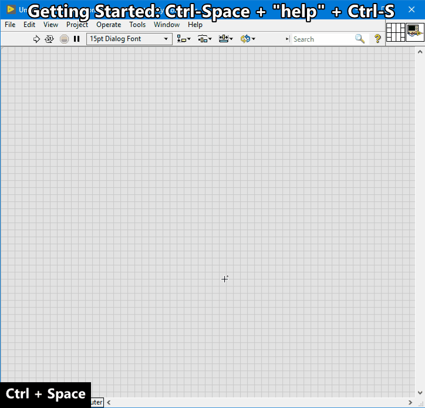

# `Ctrl-S` = Execute Script
Executes a series of VI scripts (i.e. macros) using the Quick Drop Textbox
arguments (separated by space) on the selected panel or diagram objects.
Many scripts are [Built-in](#built-in-shortcuts) for common operations,
such as: align + distribute objects, connect terminals to pane, change
representation, hide/show display objects, etc.

**Getting Started:** `Ctrl-Space` + **`"help"`** + `Ctrl-S`



## Background
I quickly realized there aren't enough keys on the keyboard for each Quick
Drop Plugin needed. So instead, I created the Execute Script plugin which uses
the Quick Drop Textbox to define a series of commands to execute on the
selected panel or diagram objects. Unlike Quick Drop Plugins, scripts can be
daisy chained together to increase speed and efficiency:

`Ctrl-Space` + **`"u8 rx hb"`** + `Ctrl-S` = `Change to U8` +
`Show Radix in Hex` + `Hide Inc/Dec Buttons`

Execute Scripts also includes a shortcut configuration dialog (similar to the
Quick Drop Plugins dialog) to manage custom shortcuts. Refer to
[Custom Shortcuts and Plugins](#custom-shortcuts-and-plugins)
for support on how to add your own shortcuts and script plugins.

---

## Built-in Shortcuts
The following built-in shortcuts are supported out of the box. Shortcuts that
start with `--` return the remaining arguments to the plugin which are
typically used to set labels, captions or pass parameters.

| Shortcut | Name |
| --- | --- |
| `--` | [Rename Label](#----rename-label) |
| `--c` | [Rename Caption](#--c--rename-caption) |
| `--icon` | [Edit VI Icon](#--icon--edit-vi-icon) |
| `0` | [Open in File Explore](#0--open-in-file-explore) |
| `a` | [Arrange](#a--arrange) |
| `aa` | [Align Left Edges](#aa--align-left-edges) |
| `ad` | [Align Right Edges](#ad--align-right-edges) |
| `ah` | [Align Horizontal Centers](#ah--align-horizontal-centers) |
| `as` | [Align Bottom Edges](#as--align-bottom-edges) |
| `av` | [Align Vertical Centers](#av--align-vertical-centers) |
| `aw` | [Align Top Edges](#aw--align-top-edges) |
| `c` | [Connect Pane](#c--connect-pane) |
| `cf` | [Cluster Size Fit](#cf--cluster-size-fit) |
| `ch` | [Cluster Size Horizontally](#ch--cluster-size-horizontally) |
| `cn` | [Cluster Size None](#cn--cluster-size-none) |
| `cv` | [Cluster Size Vertically](#cv--cluster-size-vertically) |
| `d` | [Distribute Vertical Compress](#d--distribute-vertical-compress) |
| `da` | [Distribute Left Edges](#da--distribute-left-edges) |
| `dd` | [Distribute Right Edges](#dd--distribute-right-edges) |
| `df` | [Distribute Horizontal Compress ](#df--distribute-horizontal-compress) |
| `dh` | [Distribute Horizontal Centers](#dh--distribute-horizontal-centers) |
| `dhg` | [Distribute Horizontal Gap](#dhg--distribute-horizontal-gap) |
| `ds` | [Distribute Bottom Edges](#ds--distribute-bottom-edges) |
| `dv` | [Distribute Vertical Centers](#dv--distribute-vertical-centers) |
| `dvg` | [Distribute Vertical Gap](#dvg--distribute-vertical-gap) |
| `dw` | [Distribute Top Edges](#dw--distribute-top-edges) |
| `e` | [Resizes Window](#e--resizes-window) |
| `er` | [Error Structure](#er--error-structure) |
| `hb` | [Hide Inc/Dec Buttons](#hb--hide-incdec-buttons) |
| `hc` | [Hide Caption](#hc--hide-caption) |
| `hi` | [Hide Index Display](#hi--hide-index-display) |
| `hl` | [Hide Label](#hl--hide-label) |
| `hr` | [Hide Radix](#hr--hide-radix) |
| `hs` | [Hide Scrollbars](#hs--hide-scrollbars) |
| `m` | [Merge Icon Layers](#m--merge-icon-layers) |
| `o` | [Reset Panel Origins](#o--reset-panel-origins) |
| `rb` | [Radix Binary or Backslash](#rb--radix-binary-or-backslash) |
| `rd` | [Radix Decimal or Normal](#rd--radix-decimal-or-normal) |
| `rx` | [Radix Hex](#rx--radix-hex) |
| `sb` | [Show Inc/Dec Buttons](#sb--show-incdec-buttons) |
| `sc` | [Show Caption](#sc--show-caption) |
| `si` | [Show Index Display](#si--show-index-display) |
| `sl` | [Show Label](#sl--show-label) |
| `ss` | [Show Scrollbars](#ss--show-scrollbars) |
| `sel` | [Select Controls and Indicators](#sel--select-controls-and-indicators) |
| `selc` | [Select Controls](#selc--select-controls) |
| `seli` | [Select Indicators](#seli--select-indicators) |
| `seln` | [Select None](#seln--select-none) |
| `sg` | [Snap to Panel Grid](#sg--snap-to-panel-grid) |
| `u8` | [Change to U8](#u8--change-to-u8) |
| `u16` | [Change to U16](#u16--change-to-u16) |
| `u32` | [Change to U32](#u32--change-to-u32) |
| `u64` | [Change to U64](#u64--change-to-u64) |
| `i8` | [Change to I8](#i8--change-to-i8) |
| `i16` | [Change to I16](#i16--change-to-i16) |
| `i32` | [Change to I32](#i32--change-to-i32) |
| `i64` | [Change to I64](#i64--change-to-i64) |
| `sgl` | [Change to SGL](#sgl--change-to-sgl) |
| `dbl` | [Change to DBL](#dbl--change-to-dbl) |
| `ext` | [Change to EXT](#ext--change-to-ext) |
| `csg` | [Change to CSG](#csg--change-to-csg) |
| `cdb` | [Change to CDB](#cdb--change-to-cdb) |
| `cxt` | [Change to CXT](#cxt--change-to-cxt) |
| `vi` | [VI Voodoo](#vi--vi-voodoo) |

---

### `--` = Rename Label
Renames the selected object's label.

> **Support:** `FP | BD` | **GObject:** `Objects with Labels` |
**Selection:** `1`

**Usage:** `-- LABEL` + `Ctrl-S`

**Example:** `FP` + `Select Control` + `Ctrl-Space` +
**`"-- My New Label"`** + `Ctrl-S`


---

### `--c` = Rename Caption
Renames the selected control's caption and hides the label if visible.

> **Support:** `FP | BD` | **GObject:** `Controls` | **Selection:** `1`

**Usage:** `--c CAPTION` + `Ctrl-S`

**Example:** `FP` + `Select Control` + `Ctrl-Space` + **`"--c My New
Caption"`** + `Ctrl-S`


---

### `--icon` = Edit VI Icon
Edits the VI icon. Refer to the [Color Names](ColorNames.md) page to see
supported color names.

> **Support:** `FP | BD` | **GObject:** `N/A` | **Selection:** `N/A`

**Usage:** `--icon [TEXT1 TEXT2 TEXT3 TEXT4] [options]` + `Ctrl-S`

**Options:**
* `-bc BORDER_COLOR` = Icon border color as [`COLOR_NAME`|`#RRGGBB`] (`black`)
* `-c FILL_COLOR` = Icon fill color as [`COLOR_NAME`|`#RRGGBB`] (`none`)
* `-g GLYPH` = Icon glyph (`none`)
  * Glyphs:
  [`none`|`get`|`set`|`create`|`config`|`read`|`write`|`cmd`|`tlm`|`destroy`
  |`ctl`|`ctl_cmd`|`ctl_tlm`]
* `-h HEADER` = Icon header text as [`owner`|`TEXT`]. Use `owner` to inherit
  from parent. (`owner`)
* `-hc HEADER_FILL_COLOR` = Icon header fill color as [`COLOR_NAME`|`#RRGGBB`]
  (`none`)
* `-hj HEADER_JUSTIFY` = Icon header text justification as
  [`center`|`left`|`right`] (`center`)
* `-htc HEADER_TEXT_COLOR` = Icon header text color as
  [`COLOR_NAME`|`#RRGGBB`] (`black`)
* `-tc TEXT_COLOR` = Icon text color as [`COLOR_NAME`|`#RRGGBB`] (`black`)
* `-tj TEXT_JUSTIFY` = Icon text justification as [`center`|`left`|`right`]
  (`center`)

**Example:** `FP` + `Ctrl-Space` + **`"--icon READ ID -h DRIVER -hc skyblue -g
read"`** + `Ctrl-S`
<br>

---

### `0` = Open in File Explore
Opens the file's location on disk in File Explore.
<br>Error 1 is returned if file is not saved to disk.

> **Support:** `FP | BD` | **GObject:** `N/A` | **Selection:** `N/A`

**Usage:** `0` + `Ctrl-S`

**Example:** `FP` + `Ctrl-Space` + **`"0"`** + `Ctrl-S`

---

### `a` = Arrange
Arranges the selected panel or diagram objects relative to adjacent object
position.

Refer to [Arrange Panel or Diagram](Arrange.md) for more information.

> **Support:** `FP | BD` | **GObject:** `Any` | **Selection:** `0+`

**Usage:** `a` + `Ctrl-S`

**Example:** `BD` + **`"a"`** + `Ctrl-S`
<br>*Move control and indicator terminals to the left and right sides
respectively and arrange the terminals vertically to the adjacent object.*


---

### `aa` = Align Left Edges
Aligns the selected panel or diagram objects to the respective edges or
centers excluding display objects (labels, captions, inc/dec buttons, index
displays, etc.) and sets the corresponding LabVIEW Align Tool.

> **Support:** `FP | BD` | **GObject:** `Any` | **Selection:** `2+`

**Usage:** `aa` + `Ctrl-S`

**Example:** `FP` + `Select 2 Controls` + **`"aa"`** + `Ctrl-S`
<br>*Align controls by their left edges (excluding any labels, caption,
display objects).*


### `ad` = Align Right Edges
See [Align Left Edges](#aa--align-left-edges).

### `ah` = Align Horizontal Centers
See [Align Left Edges](#aa--align-left-edges).

### `as` = Align Bottom Edges
See [Align Left Edges](#aa--align-left-edges).

### `av` = Align Vertical Centers
See [Align Left Edges](#aa--align-left-edges).

### `aw` = Align Top Edges
See [Align Left Edges](#aa--align-left-edges).

---

### `c` = Connect Pane
Connects the selected front panel controls or indicators to the VI's connector
pane. If nothing is selected this connects all controls and indicators. Wired
controls are ignored. Error clusters are prioritized to the bottom-left and
bottom-right connector pane positions. Hold `Shift` to start wiring in the
middle.

> **Support:** `FP` | **GObject:** `Controls` | **Selection:** `0+`

**Usage:** `c` + `Ctrl-S`

**Example:** `FP` + `Select Controls` + `Ctrl-Space` + **`"c"`** + `Ctrl-S`
<br>*Wire selected controls to empty connector pane terminals.*


---

### `cf` = Cluster Size Fit
Sets the selected cluster's auto sizing to 'None', 'Size to Fit', 'Arrange
Horizontally' or 'Arrange Vertically'.

> **Support:** `FP | BD` | **GObject:** `Clusters | Cluster Constants` |
**Selection:** `1+`

**Usage:** `cf` + `Ctrl-S`

**Example:** `FP` + `Select Cluster` + `Ctrl-Space` + **`"cv"`** + `Ctrl-S`
<br>*Auto size the selected cluster vertically.*


### `ch` = Cluster Size Horizontally
See [Cluster Size Fit](#cf--cluster-size-fit).

### `cn` = Cluster Size None
See [Cluster Size Fit](#cf--cluster-size-fit).

### `cv` = Cluster Size Vertically
See [Cluster Size Fit](#cf--cluster-size-fit).

---

### `d` = Distribute Vertical Compress
Distributes the selected panel or diagram objects including display objects
(labels, captions, inc/dec buttons, index displays, etc.) and sets the
corresponding LabVIEW Distribute Tool.

> **Support:** `FP | BD` | **GObject:** `Any` | **Selection:** `2+`

**Usage:** `d` + `Ctrl-S`

**Example:** `FP` + `Select Controls` + `Ctrl-Space` + **`"d"`** + `Ctrl-S`
<br>*Vertically compresses selected controls.*


### `da` = Distribute Left Edges
See [Distribute Vertical Compress](#d--distribute-vertical-compress).

### `dd` = Distribute Right Edges
See [Distribute Vertical Compress](#d--distribute-vertical-compress).

### `df` = Distribute Horizontal Compress
See [Distribute Vertical Compress](#d--distribute-vertical-compress).

### `dh` = Distribute Horizontal Centers
See [Distribute Vertical Compress](#d--distribute-vertical-compress).

### `dhg` = Distribute Horizontal Gap
See [Distribute Vertical Compress](#d--distribute-vertical-compress).

### `ds` = Distribute Bottom Edges
See [Distribute Vertical Compress](#d--distribute-vertical-compress).

### `dv` = Distribute Vertical Centers
See [Distribute Vertical Compress](#d--distribute-vertical-compress).

### `dvg` = Distribute Vertical Gap
See [Distribute Vertical Compress](#d--distribute-vertical-compress).

### `dw` = Distribute Top Edges
See [Distribute Vertical Compress](#d--distribute-vertical-compress).

---

### `e` = Resizes Window
Resizes the panel or diagram window to content. On the panel, the window
resizes to the bottom-right most control and resets the panel origins
to 0, 0 (even if there are controls top or left of the origins).

> **Support:** `FP | BD` | **GObject:** `N/A` | **Selection:** `N/A`

**Usage:** `e` + `Ctrl-S`

**Example:** `BD` + `Ctrl-Space` + **`"e"`** + `Ctrl-S`
<br>*Resizes the block diagram window to content.*


---

### `er` = Error Structure
On the panel, this replaces the selected controls or indicators with
`Error In 3D.ctl` and `Error Out 3D.ctl` respectively. On the diagram, this
wires the selected case structure selector to the connected error wire and
wires the error out terminal if exists. If the selected case structure
selector is already wired, this does nothing.
<br>Error 1055 is raised if no error wire if found connected to the case
structure.

> **Support:** `FP | BD` | **GObject:** `Controls | Case Structure` |
**Selection:** `1+`

**Usage:** `er` + `Ctrl-S`

**Example:** `BD` + `Select Case Structure` + `Ctrl-Space` + **`"er"`** +
`Ctrl-S`
<br>*Rewire the case structure to the error wire.*


---

### `hb` = Hide Inc/Dec Buttons
Hides the increment / decrement buttons on the selected numerics if they exist.
<br>*LV2019 Bug: Timestamps do not have a property node to hide the inc/dec
buttons.*
<br>**Related:** [Show Inc/Dec Buttons](#sb--show-incdec-buttons).

> **Support:** `FP` | **GObject:** `Numerics` | **Selection:** `1+`

**Usage:** `hb` + `Ctrl-S`

**Example:** `FP` + `Select Numeric` + `Ctrl-Space` + **`"hb"`** + `Ctrl-S`
<br>*Hide the inc/dec buttons.*


### `hc` = Hide Caption
Hides the captions on the selected controls.
<br> **Note: Captions are persistent references that are only created when the
reference is accessed. This means the caption is not destroyed when hidden.
As of LV2019, the only method to destroy a caption is manually through the
control's property menu.**
<br>**Related:** [Show Caption](#sc--show-caption).

> **Support:** `FP` | **GObject:** `Controls` | **Selection:** `1+`

**Usage:** `hc` + `Ctrl-S`

**Example:** See [Hide Inc/Dec Buttons](#hb--hide-incdec-buttons).

### `hi` = Hide Index Display
Hides the index displays on the selected arrays if they exist.
<br>**Related:** [Show Index Display](#si--show-index-display).

> **Support:** `FP | BD` | **GObject:** `Arrays | Array Constants` |
**Selection:** `1+`

**Usage:** `hi` + `Ctrl-S`

**Example:** See [Hide Inc/Dec Buttons](#hb--hide-incdec-buttons).

### `hl` = Hide Label
Hides the labels on the selected objects if they exist.
<br>**Related:** [Show Label](#sl--show-label).

> **Support:** `FP | BD` | **GObject:** `Objects with labels` | **Selection:**
`1+`

**Usage:** `hl` + `Ctrl-S`

**Example:** See [Hide Inc/Dec Buttons](#hb--hide-incdec-buttons).

### `hr` = Hide Radix
Hides the radix display on the selected numerics or strings if they exist.
<br>**Related:** [Radix Binary or Backslash](#rb--radix-binary-or-backslash).

> **Support:** `FP | BD` | **GObject:** `Numerics with radix | Strings with
radix` | **Selection:** `1+`

**Usage:** `hr` + `Ctrl-S`

**Example:** See [Hide Inc/Dec Buttons](#hb--hide-incdec-buttons).

### `hs` = Hide Scrollbars
Hides the scrollbars on the selected controls with scrollbars if they exist.
<br>**Related:** [Show Scrollbars](#ss--show-scrollbars).

> **Support:** `FP | BD` | **GObject:** `Objects with scrollbars` |
**Selection:** `1+`

**Usage:** `hs` + `Ctrl-S`

**Example:** See [Hide Inc/Dec Buttons](#hb--hide-incdec-buttons).

---

### `m` = Merge Icon Layers
Flattens the VI icon layers to avoid icon template collisions.
<br>**Warning: This action cannot be undone.**

> **Support:** `FP | BD` | **GObject:** `N/A` | **Selection:** `N/A`

**Usage:** `m` + `Ctrl-S`

**Example:** `FP` + `Ctrl-Space` + **`"m"`** + `Ctrl-S`
<br>*Flattens icon layers.*


---

### `o` = Reset Panel Origins
Resets all panel orgins to (0, 0) regardless if the panel grid is visible or
enabled.

> **Support:** `FP` | **GObject:** `N/A` | **Selection:** `N/A`

**Usage:** `o` + `Ctrl-S`

**Example:** `FP` + `Ctrl-Space` + **`"o"`** + `Ctrl-S`
<br>*Resets all panel origins.*


---

### `rb` = Radix Binary or Backslash
Shows the radix display in binary (or backslash) on the selected numerics
or strings if they exist. For numerics, this will also format the display
string according to the bit size (e.g. U16 = `"%016b"` = `0000000000001010`).
<br>*Note: Float, Complex, Ring, Enum numeric types do not support binary
radix displays and revert to
[Radix Deciaml or Normal](#rd--radix-decimal-or-normal).*
<br>**Related:** [Hide Radix](#hr--hide-radix).

> **Support:** `FP | BD` | **GObject:** `Numerics | Numeric Constants |
Strings | String Constants` | **Selection:** `1+`

**Usage:** `rb` + `Ctrl-S`

**Example:** `FP` + `Select U8 numeric control` + `Ctrl-Space` + **`"rb"`** +
`Ctrl-S`
<br>*Display numeric radix in binary (e.g. `00000000`).*


### `rd` = Radix Decimal or Normal
Shows the radix display in decimal (or normal) on the selected numerics
or strings if they exist. For numerics, this will also format the display
string according to the data type (e.g. Integers/Unsigned-Integers = `"%d"`,
Floats/Complex = `"%#g"`).
<br>**Related:** [Hide Radix](#hr--hide-radix).

> **Support:** `FP | BD` | **GObject:** `Numerics | Numeric Constants |
Strings | String Constants` | **Selection:** `1+`

**Usage:** `rb` + `Ctrl-S`

**Example:** See [Radix Binary or Backslash](#rb--radix-binary-or-backslash).

### `rx` = Radix Hex
Shows the radix display in hex on the selected numerics or strings if they
exist. For numerics, this will also format the display string according to the
data type (e.g. U16 = `"%04x"` = `FFFF`).
<br>*Note: Float, Complex, Ring, Enum numeric types do not support hex
radix displays and revert to
[Radix Deciaml or Normal](#rd--radix-decimal-or-normal).*
<br>**Related:** [Hide Radix](#hr--hide-radix).

> **Support:** `FP | BD` | **GObject:** `Numerics | Numeric Constants |
Strings | String Constants` | **Selection:** `1+`

**Usage:** `rx` + `Ctrl-S`

**Example:** See [Radix Binary or Backslash](#rb--radix-binary-or-backslash).

---

### `sb` = Show Inc/Dec Buttons
Shows the increment / decrement buttons on the selected numerics if they exist.
<br>*LV2019 Bug: Timestamps do not have a property node to show the inc/dec
buttons.*
<br>**Related:** [Hide Inc/Dec Buttons](#hb--hide-incdec-buttons).

> **Support:** `FP` | **GObject:** `Numerics` | **Selection:** `1+`

**Usage:** `sb` + `Ctrl-S`

**Example:** `FP` + `Select Numeric` + `Ctrl-Space` + **`"sb"`** + `Ctrl-S`
<br>*Show the inc/dec buttons.*


### `sc` = Show Caption
Shows the captions on the selected controls. If the caption is empty, the
label is used, if the label is empty a "Caption" placeholder is created.
<br>**Related:** [Hide Caption](#hc--hide-caption).

> **Support:** `FP` | **GObject:** `Controls` | **Selection:** `1+`

**Usage:** `sc` + `Ctrl-S`

**Example:** See [Show Inc/Dec Buttons](#sb--show-incdec-buttons).

### `si` = Show Index Display
Shows the index displays on the selected arrays if they exist.
<br>**Related:** [Hide Index Display](#hi--hide-index-display).

> **Support:** `FP | BD` | **GObject:** `Arrays | Array Constants` |
**Selection:** `1+`

**Usage:** `si` + `Ctrl-S`

**Example:** See [Show Inc/Dec Buttons](#sb--show-incdec-buttons).

### `sl` = Show Label
Shows the labels on the selected objects if they exist.
<br>**Related:** [Hide Label](#hl--hide-label).

> **Support:** `FP | BD` | **GObject:** `Objects with labels` | **Selection:**
`1+`

**Usage:** `sl` + `Ctrl-S`

**Example:** See [Show Inc/Dec Buttons](#sb--show-incdec-buttons).

### `ss` = Show Scrollbars
Shows the scrollbars on the selected objects with scrollbars if they exist.
<br>**Related:** [Hide Scrollbars](#hs--hide-scrollbars).

> **Support:** `FP | BD` | **GObject:** `Objects with scrollbars` |
**Selection:** `1+`

**Usage:** `ss` + `Ctrl-S`

**Example:** See [Show Inc/Dec Buttons](#sb--show-incdec-buttons).

---

### `sel` = Select Controls and Indicators
Selects all controls and indicators on the panel or diagram.

> **Support:** `FP | BD` | **GObject:** `Controls | Control Terminals` |
**Selection:** `N/A`

**Usage:** `sel` + `Ctrl-S`

**Example:** `FP` + `Ctrl-Space` + **`"sel"`** + `Ctrl-S`
<br>*Select all controls and indicators on panel.*


### `selc` = Select Controls
Selects all controls on the panel or diagram.

> **Support:** `FP | BD` | **GObject:** `Controls | Control Terminals` |
**Selection:** `N/A`

**Usage:** `selc` + `Ctrl-S`

**Example:** See
[Select Controls and Indicators](#sel--select-controls-and-indicators)

### `seli` = Select Indicators
Selects all indicators on the panel or diagram.

> **Support:** `FP | BD` | **GObject:** `Controls | Control Terminals` |
**Selection:** `N/A`

**Usage:** `seli` + `Ctrl-S`

**Example:** See
[Select Controls and Indicators](#sel--select-controls-and-indicators)

### `seln` = Select None
Clears the selection list on the panel or diagram.

> **Support:** `FP | BD` | **GObject:** `N/A` | **Selection:** `N/A`

**Usage:** `seln` + `Ctrl-S`

**Example:** See
[Select Controls and Indicators](#sel--select-controls-and-indicators)

---

### `sg` = Snap to Panel Grid
Snaps the selected controls or indicators to panel grid. If nothing is
selected, this snaps all controls and indicators to the panel grid. If the
panel grid size is not defined or zero, this defauls the panel grid size to
`12`. Display objects (labels, captions, inc/dec buttons, index displays,
etc.) are excluded when snapping to nearest grid size.

> **Support:** `FP` | **GObject:** `Controls` | **Selection:** `0+`

**Usage:** `sg` + `Ctrl-S`

**Example:** `FP` + `Select controls` + `Ctrl-Space` + **`"sg"`** + `Ctrl-S`
<br>*Snap the selected controls to nearest grid position.*


---

### `u8` = Change to U8
Changes the selected numeric data type representations to Unsigned 8-bit
Integer (U8).

> **Support:** `FP` | **GObject:** `Numerics | Numeric Constants` |
**Selection:** `1+`

**Usage:** `u8` + `Ctrl-S`

**Example:** `FP` + `Select controls` + `Ctrl-Space` + **`"u8"`** + `Ctrl-S`
<br>*Change the selected numeric controls to Unsigned 8-bit.*


### `u16` = Change to U16
Changes the selected numeric data type representations to Unsigned 16-bit
Integer (U16).

See [Change to U8](#u8--change-to-u8).

### `u32` = Change to U32
Changes the selected numeric data type representations to Unsigned 32-bit
Integer (U32).

See [Change to U8](#u8--change-to-u8).

### `u64` = Change to U64
Changes the selected numeric data type representations to Unsigned 64-bit
Integer (U64).

See [Change to U8](#u8--change-to-u8).

### `i8` = Change to I8
Changes the selected numeric data type representations to Signed 8-bit
Integer (I8).

See [Change to U8](#u8--change-to-u8).

### `i16` = Change to I16
Changes the selected numeric data type representations to Signed 16-bit
Integer (I16).

See [Change to U8](#u8--change-to-u8).

### `i32` = Change to I32
Changes the selected numeric data type representations to Signed 32-bit
Integer (I32).

See [Change to U8](#u8--change-to-u8).

### `i64` = Change to I64
Changes the selected numeric data type representations to Signed 64-bit
Integer (I64).

See [Change to U8](#u8--change-to-u8).

### `sgl` = Change to SGL
Changes the selected numeric data type representations to Single 32-bit
Float (SGL).

See [Change to U8](#u8--change-to-u8).

### `dbl` = Change to DBL
Changes the selected numeric data type representations to Double 64-bit
Float (DBL).

See [Change to U8](#u8--change-to-u8).

### `ext` = Change to EXT
Changes the selected numeric data type representations to Extended 128-bit
Float (EXT).

See [Change to U8](#u8--change-to-u8).

### `csg` = Change to CSG
Changes the selected numeric data type representations to Single Complex
Float (CSG) where the total size is 64-bit = 32-bit Real + 32-bit Imaginary.

See [Change to U8](#u8--change-to-u8).

### `cdb` = Change to CDB
Changes the selected numeric data type representations to Double Complex
Float (CDB) where the total size is 128-bit = 64-bit Real + 64-bit Imaginary.

See [Change to U8](#u8--change-to-u8).

### `cxt` = Change to CXT
Changes the selected numeric data type representations to Extended Complex
Float (CXT) where the total size is 256-bit = 128-bit Real + 128-bit Imaginary.

See [Change to U8](#u8--change-to-u8).

---

### `vi` = VI Voodoo
It's a surprise ;)

---
## Custom Shortcuts and Plugins
The following sections describe how you can expand upon the built-in shortcuts
and build your own script plugins.

### Custom Shortcuts
From the help dialog (`Ctrl-Space` + **`"help"`** + `Ctrl-S`), navigate to the
**Script Shortcuts** tab to add your own shortcuts or customize an existing
shortcut. Enter a **Shortcut** name "abc" and select one or more **Actions**
to execute _(Press **Add** to add an action, press **Move Up/Move Down** to
reorder)_. Press **OK** to save.

*Custom shortcuts are saved to disk at:
`<LabVIEW>\resource\dialog\QuickDrop\plugins\_Script\shortcuts.txt`.*


### Custom Script Plugins
Create your own script plugins using the VI Template (\*.vit) located at:
<br>`<LabVIEW>\resource\dialog\QuickDrop\plugins\_Script\Script_Template.vit`


Unlike Quick Drop plugins *(which can only have single key shortcuts)*, Script
Plugins can handle more than one key character specified by the plugin's VI
Description as:

```
// VI Description Here...

[SCRIPT]
shortcut=Short Name
abc=My Plugin Shortcut
```

The VI Description must include a `[SCRIPT]` configuration
section at the end formatted with `shortcut=Short Name` key, value pairs.

**Script Plugin VI Requirements:**
1. Must have the same connector pane as
`QuickDrop\plugins\_Script\Script_Template.vit`
2. Must be placed in the `QuickDrop\plugins\_Script` directory
(as a VI or in an LLB)
3. Support VI's must start with an underscore ("`_*.vi`")

## Script Plugin Execution
Under the hood, here's what happens when a script is called (`Ctrl-S`):
1. All script plugin VIs *(that don't start with an underscore)* are loaded
  into memory: `QuickDrop\plugins\_Script\*.vi`
2. The plugin's shortcuts are parsed from the VI Description:
  ```
  [SCRIPT]
  abc=My Simple Shortcut
  --xyz=My Shortcut with args
  ```
3. Any custom shortcuts are loaded from:
  `QuickDrop\plugins\_Script\shortcuts.txt`.
4. The Quick Drop Textbox string is parsed into a list of actions.
5. Each action is executed in series *(until complete or an error
  occurs)*.
6. If applicable, modifications to the custom shortcuts are saved to disk.
7. If an error occurred, the changes are rolled back *(using the
  `Undo:Failed` methods)*

---
