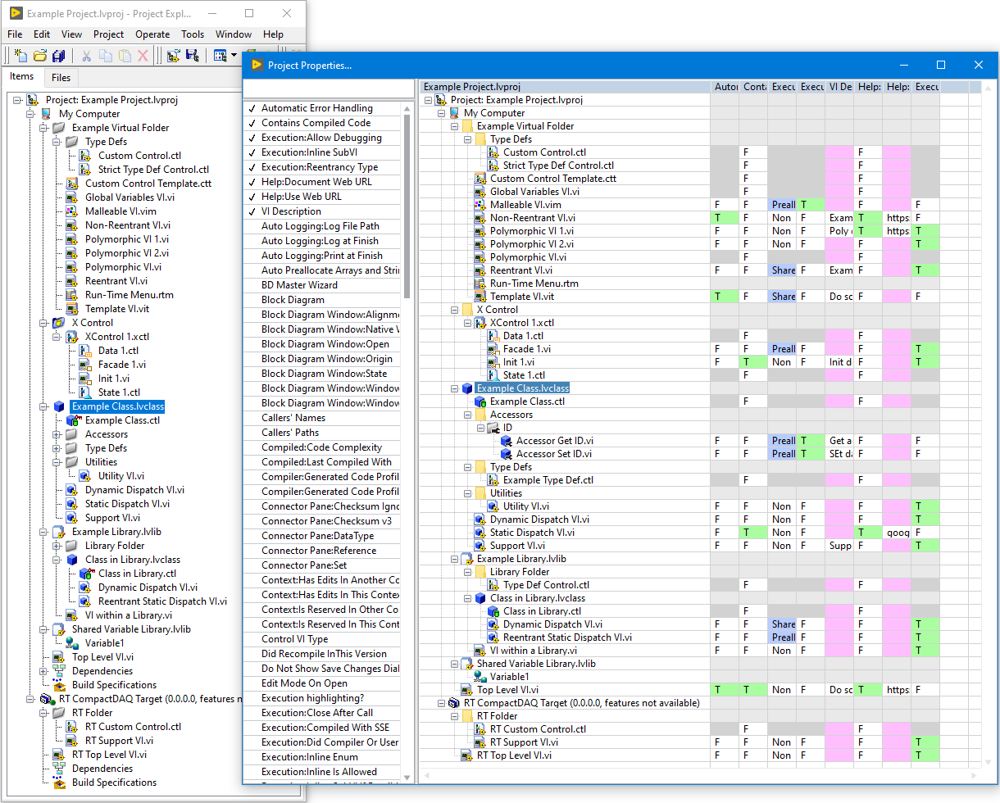
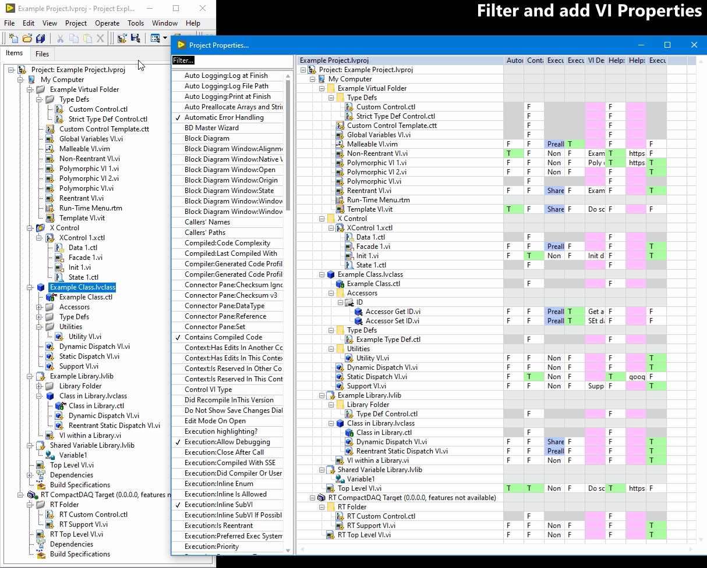
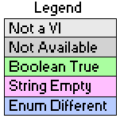

# Ryans Project Properties...
Explore VI Properties across an entire LabVIEW Project.
This is useful for quality assurance purposes to verify all VI's
`Separate Compiled Code` or `Disable Automatic Error Handling` or
are missing `VI Descriptions`, etc.

Refer to [Color Legend](#color-legend) for color descriptions.

---

## `Tools > Ryans Project Properties...`
From a LabVIEW Project window (*or a VI within the context of a
LabVIEW Project*) open the **Project Properties** window by
navigating to `Tools > Ryans Project Properties...`.
The plugin will load the active project structure (excluding
Dependencies and Build Specifications) into the project tree.

If no active project is found, this will return a warning dialog.

To add/remove a VI Property, double-click the property from the
VI Properties listbox on the left.

To open a VI, double-click the VI in the project tree.

To select all with the same property value, right-click a value and
select **Select all with value**. Use **Open Selected VIs** to open
all selected VIs for modification.

*Note: VI Properties are not editable from this window due to
the inconsistent nature of setting specific properties
programmatically. Using LabVIEW's built-in property dialogs 
ensure proper change verification and validation.*

---

### Color Legend
The project tree color codes a few different items:

| Legend | Description |
| --- | --- |
| Not a VI | Project tree item is not a VI refnum type *e.g. not a vi, vit, vim, ctl, ctt, etc.* |
| Not Available | VI property does not exist (or is not displayable) *e.g. Diagram or Panel Refnums* |
| Boolean True | Boolean value is True |
| String Empty | String value is empty |
| Enum Different | Enum value is something other than default *e.g. Reentrant type* *Note: Some enum properties are not supported.* |

---
