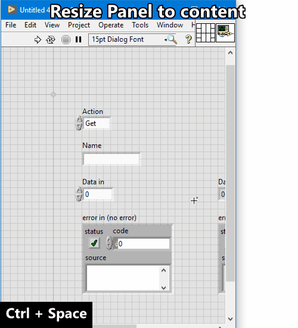
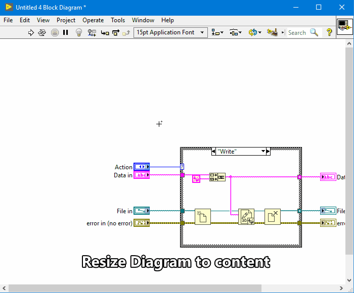

# `Ctrl-E` = Resize Diagram
Resizes the front panel or block diagram window to fit the content.

There are variations depending on Front Panel (`FP`) or Block Diagram
(`BD`) focus.

| Variations | Summary |
| --- | --- |
| `FP` | [Resize Panel Window](#fp-=-resize-panel-window) |
| `BD` |  [Resize Diagram Window](#bd-resize-diagram-window)  |

## `FP` = Resize Panel Window
Resizes the panel window to content and resets the panel origins to (0, 0).

> **Support:** `FP` | **GObject:** `N/A` | **Selection:** `N/A`

**Usage:** `FP` + `Ctrl-E`

## `BD` = Resize Diagram Window
Resizes the diagram window to content.

> **Support:** `BD` | **GObject:** `N/A` | **Selection:** `N/A`

**Usage:** `BD` + `Ctrl-E`

